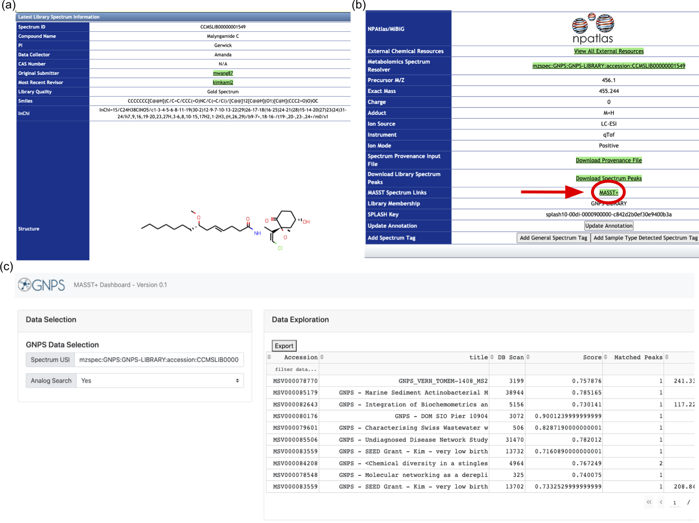

# MASST+

https://masst.ucsd.edu/masstplus/

MASST+ is an improvement on GNPS Mass Spectrometry Search Tool ([MASST](https://masst.ucsd.edu/)). MASST+ provides fast and error tolerant search of metabolomics mass spectrometry data while reducing the search time by two orders of magnitude. It is capable of querying against databases of billions of mass spectra, which was not feasible with MASST. Like MASST, MASST+ is publicly available as a web service on GNPS.

## Using MASST+

### With a Spectrum USI

If you know the [spectrum USI](https://github.com/mwang87/MetabolomicsSpectrumResolver) of a spectrum you want to search with MASST+, you can enter it directly at https://masst.ucsd.edu/masstplus/.

### Searching a spectrum in the GNPS library

(a) First, navigate to the spectrum of interest on the GNPS library. Here, a [Malyngamide C spectrum](https://proteomics3.ucsd.edu/ProteoSAFe/gnpslibraryspectrum.jsp?SpectrumID=CCMSLIB00000001549#%7B%7D) is viewed. Next, click the "MASST+" link. (c) This opens the MASST+ tab which runs a mass spectral search and presents the results.

### Integration with Molecular Networking

(a) Start by submitting a [new molecular networking](https://proteomics3.ucsd.edu/ProteoSAFe/index.jsp?task=a9c32880f76b4786a5a89682ed101d8f) job on GNPS (this will require you to be logged in to a GNPS account). (b) When the job has completed, click "View All Clusters With IDs". (c) This will open a new tab, where you can click "Advanced MASST" and then "MASST+ Search" (or "MASST+ Analog Search") in order to start a new MASST+ search. (d) This will open a new tab for MASST+, where the search results will display after a few seconds.
